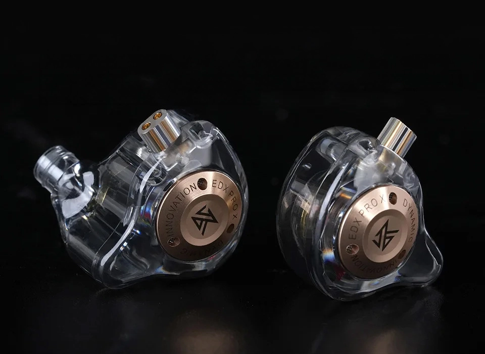

# KZ Audio EDX PRO X - Página de Producto

Este proyecto es una página web simple que presenta un producto de audífonos: **KZ Audio EDX PRO X**. Utiliza HTML y CSS para mostrar una imagen del producto, una breve descripción y su precio.

## 🖼️ Vista previa

 *(Asegúrate de que esta imagen esté en el directorio correcto.)*

## 📁 Estructura del proyecto

/project-root
│
├── index.html
├── styles.css
└── img_reference.png

## 🚀 Tecnologías utilizadas

- HTML5
- CSS3

## 📦 Cómo usar este proyecto

1. Clona este repositorio:
   ```bash
   git clone https://github.com/tu-usuario/nombre-del-repo.git
